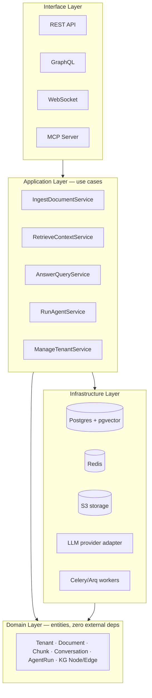
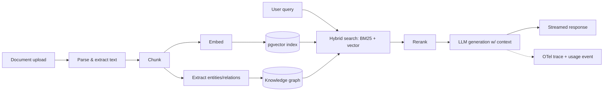

# Cortex — The Flagship Project Blueprint
### A multi-tenant AI Knowledge & Agent Platform, chosen by elimination and designed end-to-end

*Working codename: "Cortex" — pick a real name later and check it's not trademarked before you publish. Everything below is written against this name for concreteness.*

---

## 0. TL;DR

**Build one thing: a production-grade, multi-tenant backend platform that ingests unstructured documents, makes them queryable through hybrid search + a knowledge graph, lets both humans and AI agents reason over them conversationally, and exposes all of it through REST, GraphQL, WebSockets, and an MCP server.**

In plain terms: the backend for "point this at our company's documents and let people (and agents) ask it anything, safely, with an audit trail." This is not a new idea pulled from nowhere — it's the generalized, properly-sequenced version of the AI Learning & Research Workspace concept already on your radar (RAG + knowledge graph + citation manager, inspired by NotebookLM/Obsidian/Perplexity). The difference is architectural: instead of a single-user tool that tries to ship every feature at once, it's a multi-tenant platform shipped in disciplined versions — and your own research workspace becomes tenant #1, not a separate project.

It scores highest of 20 candidates evaluated below because it is the only idea that genuinely forces mastery of *every* skill bucket you listed — not most of them, all of them — while matching exactly what the market is funding and hiring for in 2026.

---

## 1. Industry Grounding (2026) — why this isn't a guess

A few current signals worth knowing before you commit 6–12 months:

- 2026 AI-engineer hiring guides converge on the same stack: <cite index="10-1">RAG over vector databases is still the most-deployed pattern in production</cite>, layered with <cite index="10-1">multi-agent orchestration using frameworks like LangGraph and CrewAI</cite>, and <cite index="10-1">OpenTelemetry-based tracing is now considered standard, not optional</cite>. The same guide flags <cite index="10-1">cost optimization as the most underrated skill</cite> — very few engineers can cut an LLM bill in half without hurting quality.
- MCP is no longer experimental. <cite index="15-1">By July 2026, about 78% of enterprise AI teams had MCP-backed agents in production, with roughly 28% of Fortune 500 companies running MCP servers and ~97 million monthly SDK downloads</cite>. Multi-tenant MCP auth is explicitly still an open problem industry-wide — which makes it a genuinely good thing to build and be able to speak to in an interview, rather than a solved textbook exercise.
- The money is following infrastructure, not demos. Recent YC batches show <cite index="34-1">a startup pitching an API-first data layer built specifically to help teams ship enterprise RAG pipelines quickly</cite>, alongside <cite index="32-1">infrastructure aimed squarely at search/retrieval teams building RAG</cite> and <cite index="32-1">an agentic document platform already used by enterprise AI teams</cite>. This is the exact product category proposed below.
- The frontier of "basic RAG" has moved: <cite index="40-1">enterprise RAG in 2026 increasingly needs knowledge graphs to surface interconnected data that pure semantic similarity misses, plus granular access controls so the AI layer itself doesn't become a data-leakage vector</cite>. Both are explicitly designed into the roadmap below, not bolted on.

Net: this isn't "build a RAG chatbot." The 2026 bar is *productionized, observable, multi-tenant, agentic* RAG — which is precisely why the project below is scoped the way it is.

---

## 2. Candidate Landscape — 20 ideas, scored

Weights: Learning 30 · Industry Relevance 20 · Resume 15 · Scalability 10 · Architecture Depth 10 · AI Integration 10 · Founder Potential 5 (100 total)

| # | Idea | Score |
|---|---|---|
| **1** | **Multi-tenant AI Knowledge & Agent Platform (the winner)** | **98** |
| 2 | Semantic Enterprise Search-as-a-Service (narrower version of #1) | 82 |
| 3 | Standalone multi-agent orchestration framework (LangGraph-style) | 79 |
| 4 | Enterprise document intelligence (extraction only, single-tenant) | 77 |
| 5 | Workflow / automation engine (Zapier/n8n-style, AI as one node type) | 75 |
| 6 | Autonomous multi-agent research platform ("AI Scientist"-style) | 75 |
| 7 | Standalone LLM observability / eval platform (mini-Langfuse) | 74 |
| 8 | Code intelligence / codebase Q&A platform | 71 |
| 9 | AI-powered helpdesk / support platform | 70 |
| 10 | LLM-powered data pipeline / ETL orchestrator | 67 |
| 11 | AI Learning & Research Workspace, as originally scoped (single-user, "build everything") | 64 |
| 12 | AI content moderation / trust & safety platform | 63 |
| 13 | AI-powered CRM | 62 |
| 14 | General observability/APM platform (non-AI-specific) | 59 |
| 15 | Real-time collaborative doc editor with AI (CRDT-based) | 58 |
| 16 | Fintech ledger / personal finance with fraud-detection ML | 58 |
| 17 | AI-powered LMS / tutor platform | 55 |
| 18 | Personal "second brain" PKM tool (consumer, Obsidian-style) | 55 |
| 19 | E-commerce platform with AI recommendations | 36 |
| 20 | Job board / marketplace platform | 29 |

Notice the shape of the top of this table: #1 doesn't beat #2, #3, and #7 by being a different idea — it beats them by being their **union**, sequenced as a version roadmap (Section 11). Search-as-a-service becomes V1–V3. The agent framework becomes V6. The observability platform becomes V4, permanently embedded rather than bolted on. Nothing on this list is wasted; it's absorbed.

---

## 3. The Top Contenders, Closer Look

**#2 Semantic Search-as-a-Service** — Nearly as strong (82/100). Loses mainly on AI Integration and Learning depth: without a conversational/agentic layer on top, you never touch tool-calling, MCP, or multi-step reasoning — a growing share of what "AI engineer" now means. It's absorbed as the first half of the winner.

**#3 Agent orchestration framework, standalone** — Strong AI-Integration score, weaker everywhere else. Built with no concrete domain, it risks becoming "your own LangGraph," which is a crowded, well-capitalized space to differentiate a solo portfolio project in. It's also weaker on database/schema depth, since a bare framework doesn't need much persistence. Absorbed as V6.

**#7 Standalone observability platform** — Genuinely hot (Langfuse was acquired by ClickHouse in Jan 2026 — a strong signal for the category), but ironically light on *doing* AI work — the product watches other systems rather than performing retrieval/generation itself, which caps Learning and AI-Integration scores. Absorbed as V4 and threaded through every later version, rather than being the whole product.

**#5 Workflow engine** — Best Architecture-Depth score outside the winner (DAG execution, event sourcing, idempotent retries are all excellent lessons). Loses on AI Integration: the LLM is just one node type among many, so it doesn't force retrieval, embeddings, or hybrid search. Its concepts (background workers, event-driven pipelines, retries) are absorbed into the ingestion pipeline (V2) instead.

**#11 Your existing Learning Workspace idea, as originally scoped** — This is the important one to be honest about. Scored on its own terms (single-user, build-everything-at-once, per the original notes) it lands at 64/100 — respectable, but well behind the winner, for two specific reasons: (1) a single-user tool never forces multi-tenant auth/RBAC/billing, which is a large fraction of what real backend jobs pay for; (2) "build all the functionality before shipping anything" is a scope-creep pattern that kills side projects — it directly depresses the Scalability score, because a project that never ships a working v1 can't evolve like a real startup. The fix isn't to abandon the idea — it's to generalize it into a platform and force yourself to ship it in thin, working slices. Your own research workflow becomes the first real tenant, which is *better* for a portfolio story than a purely personal tool, because you can talk about it as a product decision, not just a study aid.

---

## 4. The Winner: Cortex

**One sentence:** A multi-tenant backend that turns an organization's documents into a safely queryable, reasoning-capable knowledge base — accessible via REST, GraphQL, WebSockets, and MCP — with full observability and cost accounting baked in from day one.

**Real-world equivalents.** This is the same category as Glean, Hebbia, Guru, Notion AI's knowledge layer, Elicit, Vectara, and — most directly — the YC-funded Reducto (document workflows), Trieve (retrieval infrastructure), and Captain (API-first RAG data layer) surfaced in the research above. You are not inventing a market; you are building a credible, smaller instance of one that already exists and is actively funded.

**Companies that build systems like this:** any org doing enterprise search, internal AI assistants, legal/compliance document review, customer-support knowledge bases, or "chat with our docs" products — which by 2026 is most well-funded AI-native companies plus every enterprise software vendor bolting on an AI layer.

---

## 5. Why This Wins / Why Everything Else Loses

**What you'll learn that nothing else on the list forces all at once:**
Every skill bucket you listed maps onto a real, load-bearing part of this system — not a token integration:

| Your skill bucket | Where it's load-bearing in Cortex |
|---|---|
| Async, WebSockets, background workers | Ingestion pipeline (parse → chunk → embed) *must* be async and off the request path; chat responses stream over WebSocket |
| Postgres, SQL, indexing, transactions, Alembic | Core relational schema + pgvector; ingestion status transitions are transactional; schema evolves version over version |
| Redis, caching, queues | Celery/Arq broker, query-result cache, per-tenant rate-limit counters |
| RAG, embeddings, hybrid search, reranking | The core product, not a demo feature |
| Knowledge graphs | Entity/relation extraction feeding a genuinely different retrieval path than vector search alone |
| Agentic workflows, tool calling, MCP, context management | V6–V8; MCP multi-tenant auth is a live, unsolved industry problem, not a solved tutorial |
| JWT, OAuth, API keys, RBAC, rate limiting | Multi-tenancy requires all five simultaneously — there's no way to fake this on a single-user tool |
| Docker, AWS, CI/CD | V5 deployment phase, with real trade-off decisions (see Section 11) |
| Clean/hexagonal architecture, DDD, CQRS, event-driven | Modular monolith with clearly bounded contexts; CQRS is introduced only once read/write load actually diverges — teaching *when*, not just *how* |
| Observability: tracing, metrics, logging | OpenTelemetry GenAI conventions across the full pipeline from day one of V4 |
| Testing, OpenAPI | pytest + integration tests per version; FastAPI's OpenAPI docs kept accurate throughout |

**What you *won't* learn here** (said plainly, because you asked for honesty, not a sales pitch):
- Model training or fine-tuning — Cortex consumes hosted LLM APIs, it doesn't train models. That's a separate, notebook-based skill track.
- Distributed systems at hyperscale (sharding, consensus, multi-region) — a modular monolith on one Postgres instance won't need this, and shouldn't pretend to.
- Kubernetes / service mesh depth — ECS/Fargate or plain EC2 is the right scale for this project; K8s here would be complexity for its own sake, which the brief explicitly told you to avoid.
- Frontend/mobile engineering — this project is API-first by design; a thin client (you could reuse the Next.js frontend you're already restructuring) is optional, not core.
- Deep ML theory / math — this is an AI *engineering* project, not an AI *research* project.

That last point matters enough to say directly: **your long-term target is AI Research Engineer at a frontier lab, and this project does not close the gaps you already identified in your own roadmap** — ML systems design depth, fine-tuning experience, deeper math. It's the best possible project for the "AI Engineer / Backend Engineer / fast-track income" branches of that roadmap, and it stands on its own as a strong general-purpose portfolio piece, but it runs *alongside* your research-specific prep (papers, math, fine-tuning notebooks), not instead of it.

**Trade-offs you're accepting:** more upfront architectural ceremony than a quick single-user tool would need (tenants, RBAC, migrations before you have real users); slower path to something "cool to show a friend" in week one, since the multi-tenant foundation has to exist before the flashy RAG/agent features land in V3+.

---

## 6. Self-Critique

Would I confidently recommend this as *the one project* to an ambitious AI/backend engineer? Yes — with the caveats stated above made explicit rather than buried. The reasons it survives scrutiny:

1. It is not a clone or a tutorial project — nobody ships a "Cortex clone" tutorial; you'd be building your own opinions about chunking strategy, retrieval fusion, and agent safety.
2. It never has a natural end state. V9 alone (CQRS split, vector-DB migration, chaos testing, security audit) is a legitimate multi-month phase, and none of it is invented busywork — every step in Section 11 has a specific, real engineering reason attached.
3. It converts your existing "build everything at once" plan into something that will actually ship, by forcing a working v1 before v2 exists.
4. It directly prepares FAANG-style system design interviews (design a rate limiter, design a search engine, design a notification system are all sub-problems you will have actually built, not just read about), startup/YC-style building (it's literally the current YC thesis), and the applied-AI-engineer hiring bar validated in Section 1 — while being honest that it is not a substitute for research-track preparation.

If any of that had come back "no," the honest move would be to restart the ranking — it didn't.

---

## 7. Product Definition

**Vision:** Any organization's private knowledge should be as easy to query, reason over, and act on as a conversation with your sharpest colleague — safely, auditable, and reachable from any interface.

**Mission:** Ship a multi-tenant backend that ingests unstructured knowledge, indexes it with hybrid retrieval and a knowledge graph, and exposes it through REST/GraphQL/WebSocket/MCP — with tenant isolation, observability, and cost control built in from the first version, not bolted on later.

**Personas:**
- *Knowledge-ops lead at a mid-size company* — wants internal docs/wiki searchable and answerable without a six-month integration project.
- *Developer building an AI feature* — wants an API-first RAG backend instead of hand-rolling one, the same job Trieve/Captain do commercially.
- *You* — the platform's first real tenant, running your own research notes, papers, and roadmap tracking through it. This is the honest, better-shaped successor to the original Learning Workspace concept.

**Core problems solved:** RAG demos are easy; productionizing them is not — chunking pitfalls, retrieval quality, hallucination, multi-tenant data isolation, stale indexes, and auditability are where real engineering effort goes, per the industry grounding in Section 1.

**USP:** You own and can defend every layer, because you built it — unlike a project wired together from LangChain + a hosted vector DB + a hosted eval tool, which is fast to build and hard to explain in depth in an interview.

**Functional requirements (high level):** document ingestion (upload/URL/API), chunking + embedding pipeline, hybrid search + reranking, knowledge-graph extraction and traversal, streaming conversational RAG, agentic multi-step tool-calling, MCP server exposure, multi-tenant auth/RBAC/API keys, usage metering and rate limiting, audit logging.

**Non-functional requirements:** defined p95 query latency target; defined ingestion throughput target; hard tenant-data-isolation guarantee (no cross-tenant leakage, tested); OpenTelemetry coverage on 100% of LLM calls; a real test-coverage bar, not just "some tests"; secrets never in source control; encryption in transit always, at rest for document content.

**System requirements:** Python 3.12+, FastAPI, PostgreSQL 16+ with pgvector, Redis 7+, Celery or Arq for workers, Docker Compose for local dev, AWS (ECS Fargate or EC2 — decision discussed in Section 11) for deployment, GitHub Actions for CI/CD.

---

## 8. Architecture

**Layering (hexagonal / clean):**

**Bounded contexts (modular-monolith folders, one repo):**
`identity` (tenants/users/auth/RBAC/API keys) · `ingestion` (upload/parse/chunk/embed + workers) · `retrieval` (hybrid search/rerank/knowledge graph) · `conversation` (sessions/streaming/context management) · `agents` (tool registry/agent loop/MCP) · `billing` (usage metering/rate limiting) · `observability` (tracing/metrics/audit) · `platform` (config/secrets/health).

**Dependency rule:** interface → application → domain ← infrastructure. Domain code never imports FastAPI, boto3, or SQLAlchemy directly — that's what makes it *testable* clean architecture rather than decorative folder names.

**Ingestion + RAG pipeline flow:**

**Caching:** Redis in front of (a) embedding lookups for repeated content, (b) hot query results per tenant, (c) rate-limit token buckets.

**Search:** Postgres full-text (`tsvector`/GIN) fused with pgvector cosine search via reciprocal rank fusion; reranking via a cross-encoder as a second pass.

**Auth/authz:** JWT for interactive sessions, API keys (hashed at rest) for programmatic tenants, OAuth for MCP-client and third-party login, RBAC roles scoped per tenant (owner/admin/member/viewer).

**Background workers/queues:** ingestion is fully async — upload returns immediately, a worker pool does parse→chunk→embed→index, with idempotent retries (a document can safely be re-processed without duplicating chunks).

**Monitoring/deployment/CI-CD/secrets/scaling/failure recovery/logging/testing/security** are all specified together in the versioned roadmap (Section 11), since each is introduced at the point it's actually justified rather than all at once.

---

## 9. Database Design

**Core tables:**

| Table | Key columns | Notes |
|---|---|---|
| `tenants` | id, name, plan, settings (jsonb), created_at | Root of all tenant-scoped data |
| `users` | id, tenant_id FK, email, hashed_password, role enum, created_at | role: owner/admin/member/viewer |
| `api_keys` | id, tenant_id FK, key_hash, name, scopes (jsonb), rate_limit_per_min, last_used_at, revoked_at | Never store raw keys |
| `documents` | id, tenant_id FK, source_type enum, title, storage_uri, mime_type, status enum, version, created_by FK, created_at | status: pending/parsing/chunking/embedding/indexed/failed |
| `document_chunks` | id, document_id FK, tenant_id FK (denormalized), content, tsv (tsvector), token_count, chunk_index, embedding vector(1536), metadata (jsonb), created_at | Denormalized tenant_id avoids a join on every retrieval query |
| `kg_entities` | id, tenant_id FK, name, entity_type, canonical_id nullable, source_chunk_id FK | canonical_id supports entity de-duplication/linking |
| `kg_relations` | id, tenant_id FK, source_entity_id FK, target_entity_id FK, relation_type, confidence, source_chunk_id FK | |
| `conversations` | id, tenant_id FK, user_id FK, title, created_at | |
| `messages` | id, conversation_id FK, role enum, content, retrieved_chunk_ids (jsonb), token_usage (jsonb), created_at | role: user/assistant/tool |
| `agent_runs` | id, tenant_id FK, conversation_id FK nullable, goal, status enum, started_at, completed_at | status: running/completed/failed |
| `tool_calls` | id, agent_run_id FK, tool_name, input (jsonb), output (jsonb), latency_ms, status, created_at | |
| `usage_events` | id, tenant_id FK, event_type enum, units, cost_usd, created_at | Partition by month once volume justifies it |
| `audit_log` | id, tenant_id FK, actor_user_id FK nullable, actor_api_key_id FK nullable, action, resource_type, resource_id, ip_address, created_at | Append-only |

**Relationships:** every tenant-scoped table has an FK to `tenants`, cascading deletes within a tenant boundary only; `document_chunks.document_id → documents.id`; `messages.conversation_id → conversations.id`; `tool_calls.agent_run_id → agent_runs.id`; `kg_relations` self-references `kg_entities` twice (source/target).

**Indexes:** HNSW (or IVFFlat) index on `document_chunks.embedding`; GIN index on `document_chunks.tsv` for full-text; composite `(tenant_id, created_at)` on every high-write table for tenant-scoped pagination; partial index on `documents WHERE status != 'indexed'` for efficient worker polling; unique constraint on `(tenant_id, key_hash)`.

**Constraints:** FK constraints with `ON DELETE CASCADE` scoped to tenant boundaries; `CHECK` constraints on every enum column; `NOT NULL` on all tenant_id columns without exception — a null tenant_id is the single most dangerous bug class in this system.

**Normalization:** 3NF for the relational core; the one deliberate denormalization (`tenant_id` duplicated onto `document_chunks`) is a documented trade-off, not an oversight — worth an ADR entry explaining why.

**Migrations:** Alembic, one migration per schema change, autogenerate diffs reviewed by hand before applying. The real lesson to build toward: a *data* migration, not just a schema one — what happens when you switch embedding models and every existing chunk needs re-embedding at a different vector dimension. Plan for that explicitly rather than discovering it in production.

---

## 10. API Design

**REST (representative set):**
- Auth: `POST /auth/register`, `POST /auth/login`, `POST /auth/refresh`, `POST /api-keys`, `DELETE /api-keys/{id}`
- Tenant: `GET/PATCH /tenants/me`, `GET /tenants/me/usage`
- Documents: `POST /documents`, `GET /documents`, `GET /documents/{id}`, `DELETE /documents/{id}`, `GET /documents/{id}/status`
- Search: `POST /search` (hybrid), `POST /search/rerank`
- Conversations: `POST /conversations`, `GET /conversations/{id}`, `POST /conversations/{id}/messages`, `GET /conversations/{id}/messages`
- Agents: `POST /agents/runs`, `GET /agents/runs/{id}`, `GET /agents/runs/{id}/tool-calls`
- Knowledge graph: `GET /kg/entities/{id}`, `GET /kg/entities/{id}/relations`, `POST /kg/query`
- Ops: `GET /health`, `GET /health/ready`, `GET /metrics`

**GraphQL:** one `/graphql` endpoint, justified specifically for knowledge-graph traversal — "this document, its chunks, the entities extracted from them, and other documents sharing those entities" is a graph-shaped query that would otherwise need a bespoke REST endpoint per traversal pattern.

**WebSocket:** `/ws/conversations/{id}` streams token-by-token generation and pushes live ingestion-status updates, so clients don't poll `/documents/{id}/status`.

**Background/internal:** `ingest_document_task`, `embed_chunks_task`, `extract_entities_task`, `reindex_tenant_task` — not public endpoints, triggered by the ingestion service.

**MCP surface:** expose `search_knowledge_base`, `ask_knowledge_base`, `get_document`, `list_recent_documents` as MCP tools with tenant-scoped OAuth — directly tackling the multi-tenant MCP auth gap called out as unsolved in Section 1.

---

## 11. Learning Roadmap — V0 through V9+

Every version ships something that runs, end to end, before the next one starts.

| Version | Approx. duration | New concepts introduced |
|---|---|---|
| **V0 — Foundations** | Weeks 1–2 | Repo scaffolding, Docker Compose (Postgres+Redis), FastAPI skeleton, Alembic init, pytest, linting, basic CI |
| **V1 — Core + Auth** | Weeks 3–6 | Tenants/users/JWT/RBAC, document metadata CRUD, S3 upload, OpenAPI docs, integration tests, transactions |
| **V2 — Ingestion pipeline** | Weeks 7–10 | Chunking strategies, Celery/Arq workers, Redis broker+cache, idempotent retries, async status polling |
| **V3 — RAG core** | Weeks 11–16 | Embeddings, pgvector + HNSW, hybrid search (BM25+vector fusion), reranking, streaming RAG over WebSocket, context management |
| **V4 — Observability & evals** | Weeks 17–20 | OpenTelemetry GenAI tracing across the pipeline, structured logging, health checks, retrieval/faithfulness evals, per-tenant cost tracking |
| **V5 — AWS + CI/CD** | Weeks 21–26 | Containerize all services; deploy to ECS Fargate or EC2 (trade-off discussed below); S3; IAM least-privilege; Secrets Manager; Nginx/ALB; GitHub Actions CD |
| **V6 — Agentic layer** | Weeks 27–33 | Agent loop + tool calling, tool registry, loop/termination safeguards against runaway agents, per-tenant rate limiting |
| **V7 — Knowledge graph** | Weeks 34–38 | LLM-based entity/relation extraction, graph traversal queries, GraphQL endpoint, graph-aware retrieval |
| **V8 — MCP server** | Weeks 39–44 | Platform exposed as an MCP server with tenant-scoped OAuth; tested against a real MCP client |
| **V9 — Hardening (ongoing)** | Weeks 45+ | CQRS split once read/write load genuinely diverges; possible pgvector→Qdrant migration once you can articulate *why*; load testing; chaos testing (kill a worker mid-ingestion, verify safe resume); an OWASP-API-Top-10 security pass; write up each phase (feeds your existing technical-writing income stream) |

That's roughly 11 months to V8, with V9 explicitly open-ended — matching "the project should never end."

**One deployment trade-off worth deciding deliberately, not defaulting into:** start on plain EC2 with self-managed Postgres (you get real experience with connection pooling, backups, and OS-level ops) and only move to managed RDS/ECS once you can name the specific operational pain that justifies paying for managed infrastructure. That "why," articulated honestly, is a better interview answer than "I used RDS because everyone does."

---

## 12. Engineering Rules

- Ship each version as a working, demoable slice — this is the direct fix for "build everything before shipping anything." If a version isn't demoable in under two minutes, it's scoped too big.
- No microservice extraction until you can name the specific scaling problem it solves (e.g., only pull ingestion workers into their own deployable unit once you can show they need to scale independently from the API).
- Every third-party library gets a one-line justification in an `/docs/adr` folder, started in V1 — "why pgvector over a dedicated vector DB right now" is exactly the kind of entry that matters.
- Write the failing test before the fix, for every bug found from V3 onward.
- Never add a technology because it's trendy — MCP, GraphQL, and CQRS are all in this plan because they solve a specific, named problem the project actually has, not because they look good on a resume line.

---

## 13. Final Verdict

Cortex is not a rebrand of your existing idea for its own sake — it's the same instinct (RAG + knowledge graph + citation/research tooling), corrected on the one point that would have quietly sunk it: shipping. Multi-tenancy isn't extra complexity for its own sake here; it's what turns a personal study tool into the exact category of system that companies are hiring for and funding right now, per Section 1. Your existing FastAPI product and the Next.js frontend restructure aren't wasted either — if the product's domain is compatible, this roadmap can *be* its next phase; if not, this runs in parallel as the dedicated portfolio flagship, and the Next.js app is a fine (optional) thin client for it later.

Confidence in this recommendation: high, with the limits stated in Section 5 and 6 kept in view — this is the right project for AI Engineer / Backend Engineer / founder-optionality growth, and it runs *alongside*, not instead of, the research-specific prep your longer-term AI Research Engineer target still needs.
