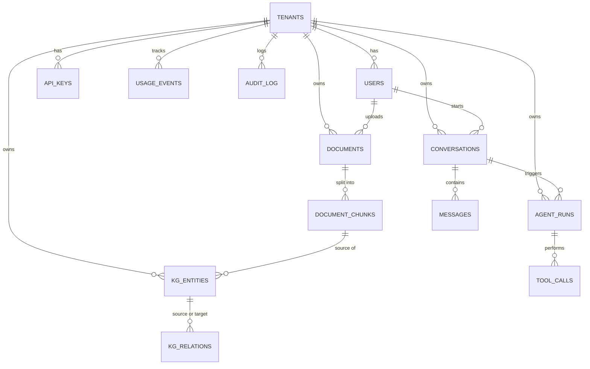

# database.md — Cortex

Companion to `cortex-engineering-blueprint.md`. This is the column-by-column database reference plus every API endpoint, documented against which tables it reads and writes.

**Conventions used throughout:** every tenant-scoped table has a `NOT NULL tenant_id` with no exceptions — a null tenant_id is the single most dangerous bug class in a multi-tenant system. Primary keys are UUIDs. Timestamps are `timestamptz`. Enum-like columns are enforced with `CHECK` constraints, not free text.

---

## 1. Database Tables

### `tenants`
The root of all tenant-scoped data — every other table traces back here.

| Column | Type | Meaning / usage |
|---|---|---|
| id | uuid, PK | Unique workspace identifier, referenced by every tenant-scoped table |
| name | text | Display name shown in the UI top bar |
| plan | enum (free/pro/enterprise) | Determines rate limits and feature access |
| settings | jsonb | Per-tenant config (default LLM/embedding model, retention policy) without needing a migration per new setting |
| created_at | timestamptz | When the workspace was created |

---

### `users`
| Column | Type | Meaning / usage |
|---|---|---|
| id | uuid, PK | Unique user identifier |
| tenant_id | uuid, FK → tenants.id | Which workspace this user belongs to — the starting scope for every "my data" query |
| email | text, unique per tenant | Login identifier |
| hashed_password | text | Argon2/bcrypt hash — the raw password is never stored |
| role | enum (owner/admin/member/viewer) | Drives every RBAC check on protected endpoints |
| created_at | timestamptz | Account creation time |

**Indexes:** unique `(tenant_id, email)`.

---

### `api_keys`
| Column | Type | Meaning / usage |
|---|---|---|
| id | uuid, PK | Key identifier |
| tenant_id | uuid, FK | Owning workspace |
| key_hash | text | Hash of the actual key — the raw key is shown once at creation and never stored again |
| name | text | Human label so a tenant can tell keys apart ("CI pipeline key") |
| scopes | jsonb | Array of permissions this key can exercise, e.g. `["search:read","documents:write"]` |
| rate_limit_per_min | int | Per-key override of the tenant's default rate limit |
| last_used_at | timestamptz, nullable | Updated on every authenticated request — surfaces stale/unused keys |
| revoked_at | timestamptz, nullable | Soft-revocation marker; null means the key is active |

**Indexes:** unique `(tenant_id, key_hash)`.

---

### `documents`
| Column | Type | Meaning / usage |
|---|---|---|
| id | uuid, PK | Document identifier |
| tenant_id | uuid, FK | Owning workspace |
| source_type | enum (upload/url/api) | How the document entered the system |
| title | text | Display name — filename or scraped page title |
| storage_uri | text | Pointer to the raw file in S3; the database never stores file bytes |
| mime_type | text | Determines which parser handles it (PDF vs DOCX vs plain text) |
| status | enum (pending/parsing/chunking/embedding/indexed/failed) | Drives the UI status badge and the worker's polling query |
| version | int | Increments on reprocessing so old chunks are cleanly superseded |
| created_by | uuid, FK → users.id | Who uploaded it — audit trail |
| created_at | timestamptz | Upload time |

**Indexes:** `(tenant_id, created_at)` for paginated listing; partial index on `WHERE status != 'indexed'` for efficient worker polling.

---

### `document_chunks`
| Column | Type | Meaning / usage |
|---|---|---|
| id | uuid, PK | Chunk identifier |
| document_id | uuid, FK → documents.id | Parent document |
| tenant_id | uuid, FK (denormalized) | Duplicated from the parent document specifically to avoid a join on every retrieval query, which runs on the hot path |
| content | text | The chunked text — what gets embedded and what's shown as the citation excerpt |
| tsv | tsvector, generated | Precomputed full-text search vector over `content` — powers the keyword half of hybrid search |
| token_count | int | Used to budget the context window when assembling retrieved chunks into a prompt |
| chunk_index | int | Position within the parent document, so the UI can show chunks in original reading order |
| embedding | vector(1536) | Semantic embedding — powers the vector half of hybrid search |
| metadata | jsonb | Page number, section heading, or other parser-supplied context shown alongside the citation |
| created_at | timestamptz | Chunk creation time |

**Indexes:** HNSW on `embedding`; GIN on `tsv`; `(tenant_id, document_id)`.

---

### `kg_entities`
| Column | Type | Meaning / usage |
|---|---|---|
| id | uuid, PK | Entity identifier |
| tenant_id | uuid, FK | Owning workspace |
| name | text | Display name ("Acme Corp", "Q3 Roadmap") |
| entity_type | text | Category (person/organization/concept/date/…) — styles the graph node differently per type |
| canonical_id | uuid, nullable, self-FK | Points to a "primary" entity record when the same real-world thing appears under different names, so duplicates resolve to one graph node |
| source_chunk_id | uuid, FK → document_chunks.id | Where this entity was extracted from — traceability back to source text |

---

### `kg_relations`
| Column | Type | Meaning / usage |
|---|---|---|
| id | uuid, PK | Relation identifier |
| tenant_id | uuid, FK | Owning workspace |
| source_entity_id | uuid, FK → kg_entities.id | One end of the edge |
| target_entity_id | uuid, FK → kg_entities.id | Other end of the edge |
| relation_type | text | The label on the edge ("works at", "mentions", "supersedes") |
| confidence | float | Extraction model's confidence — used to filter low-quality edges out of the graph view |
| source_chunk_id | uuid, FK | Traceability back to the text that produced this relation |

---

### `conversations`
| Column | Type | Meaning / usage |
|---|---|---|
| id | uuid, PK | Conversation identifier |
| tenant_id | uuid, FK | Owning workspace |
| user_id | uuid, FK → users.id | Who owns this conversation |
| title | text | Auto-generated from the first message, or renamed by the user |
| created_at | timestamptz | Start time |

---

### `messages`
| Column | Type | Meaning / usage |
|---|---|---|
| id | uuid, PK | Message identifier |
| conversation_id | uuid, FK | Parent conversation |
| role | enum (user/assistant/tool) | Who or what produced this message |
| content | text | The message body |
| retrieved_chunk_ids | jsonb | Array of `document_chunks.id` retrieved and used to ground this specific assistant answer — this is exactly what powers the citation panel in the UI |
| token_usage | jsonb | Prompt/completion token counts for this message, rolled up into `usage_events` |
| created_at | timestamptz | Message time |

**Indexes:** `(conversation_id, created_at)` for ordered retrieval.

---

### `agent_runs`
| Column | Type | Meaning / usage |
|---|---|---|
| id | uuid, PK | Run identifier |
| tenant_id | uuid, FK | Owning workspace |
| conversation_id | uuid, FK, nullable | Set if the run happened inside a chat; null for a standalone/API-triggered run |
| goal | text | The objective given to the agent |
| status | enum (running/completed/failed) | Current run state |
| started_at / completed_at | timestamptz | Used to compute latency and enforce the max-time budget |

---

### `tool_calls`
| Column | Type | Meaning / usage |
|---|---|---|
| id | uuid, PK | Call identifier |
| agent_run_id | uuid, FK | Parent run |
| tool_name | text | Which tool was invoked ("search_knowledge_base", "calculator", …) |
| input | jsonb | Arguments passed to the tool |
| output | jsonb | What the tool returned |
| latency_ms | int | Per-tool performance tracking |
| status | enum (success/error) | Outcome of this specific call |
| created_at | timestamptz | Call time |

---

### `usage_events`
| Column | Type | Meaning / usage |
|---|---|---|
| id | uuid, PK | Event identifier |
| tenant_id | uuid, FK | Owning workspace |
| event_type | enum (embedding/completion/rerank/storage) | What kind of billable activity occurred |
| units | numeric | Quantity — meaning depends on `event_type` (tokens, MB stored, calls) |
| cost_usd | numeric | Estimated cost of this event, rolled up for the Usage & Billing screen |
| created_at | timestamptz | Event time — table is partitioned by month once volume justifies it |

---

### `audit_log`
| Column | Type | Meaning / usage |
|---|---|---|
| id | uuid, PK | Log entry identifier |
| tenant_id | uuid, FK | Owning workspace |
| actor_user_id | uuid, FK, nullable | Who did it, if a human |
| actor_api_key_id | uuid, FK, nullable | Or which API key did it, if programmatic |
| action | text | What happened, e.g. `document.deleted`, `api_key.created` |
| resource_type / resource_id | text | What it happened to |
| ip_address | text | Origin of the request, for security review |
| created_at | timestamptz | Append-only — never updated or deleted |

---

## 2. Entity Relationships

---

## 3. API Endpoints

Every endpoint below is documented with what it does and exactly which tables it reads and writes.

### Auth & Identity

| Endpoint | Purpose | Auth | Tables |
|---|---|---|---|
| `POST /auth/register` | Create a user account (and a tenant, if this is a fresh signup) | None | Writes `users`, `tenants` |
| `POST /auth/login` | Authenticate, issue a JWT | None | Reads `users` |
| `POST /auth/refresh` | Exchange a refresh token for a new access token | Refresh token | Reads `users` |
| `POST /tenants` | Create a new workspace; caller becomes owner | JWT | Writes `tenants`, `users` |
| `GET /tenants/me` | Get the current workspace's profile/settings | JWT / API key | Reads `tenants` |
| `PATCH /tenants/me` | Update workspace name/settings | JWT (owner/admin) | Writes `tenants` |
| `GET /tenants/me/usage` | Usage/cost summary for the current period | JWT / API key | Reads `usage_events` (aggregated) |
| `POST /users/invite` | Invite a teammate by email with a role | JWT (owner/admin) | Writes `users` |
| `PATCH /users/{id}/role` | Change a member's role | JWT (owner/admin) | Writes `users` |
| `DELETE /users/{id}` | Remove a member from the workspace | JWT (owner/admin) | Writes `users` |
| `POST /api-keys` | Generate a key (raw value returned once) | JWT (owner/admin) | Writes `api_keys` |
| `GET /api-keys` | List keys, masked | JWT | Reads `api_keys` |
| `DELETE /api-keys/{id}` | Revoke a key | JWT (owner/admin) | Writes `api_keys` (sets `revoked_at`) |

### Documents & Ingestion

| Endpoint | Purpose | Auth | Tables |
|---|---|---|---|
| `POST /documents` | Upload a file or submit a URL; returns immediately, ingestion runs async | JWT / API key | Writes `documents` (status=pending); worker later writes `document_chunks` |
| `GET /documents` | Paginated list of the tenant's documents | JWT / API key | Reads `documents` |
| `GET /documents/{id}` | Document detail + metadata | JWT / API key | Reads `documents` |
| `GET /documents/{id}/status` | Poll ingestion status | JWT / API key | Reads `documents.status` |
| `POST /documents/{id}/reprocess` | Retry a failed ingestion idempotently | JWT | Writes `documents` (version++), `document_chunks` |
| `DELETE /documents/{id}` | Delete a document | JWT (member+) | Writes `documents`; cascades to `document_chunks`, `kg_entities` |

### Search & Retrieval

| Endpoint | Purpose | Auth | Tables |
|---|---|---|---|
| `POST /search` | Hybrid (keyword + vector) search over the tenant's chunks | JWT / API key | Reads `document_chunks` (`tsv` + `embedding`); writes `usage_events` |
| `POST /search/rerank` | Rerank a candidate set of chunks against a query | JWT / API key | Reads `document_chunks`; writes `usage_events` |

### Conversations & Chat

| Endpoint | Purpose | Auth | Tables |
|---|---|---|---|
| `POST /conversations` | Start a new conversation | JWT | Writes `conversations` |
| `GET /conversations` | List a user's conversations | JWT | Reads `conversations` |
| `GET /conversations/{id}` | Conversation + its messages | JWT | Reads `conversations`, `messages` |
| `POST /conversations/{id}/messages` | Send a message; triggers retrieval + generation | JWT / API key | Writes `messages` (user + assistant); reads `document_chunks`; writes `usage_events` |
| `DELETE /conversations/{id}` | Delete a conversation | JWT | Writes `conversations`; cascades to `messages` |
| `WS /ws/conversations/{id}` | Stream tokens live; push ingestion status updates | JWT (token param) | Writes `messages` once the streamed response completes |

### Agents

| Endpoint | Purpose | Auth | Tables |
|---|---|---|---|
| `POST /agents/runs` | Start a multi-step agent run | JWT / API key | Writes `agent_runs` |
| `GET /agents/runs/{id}` | Get run status/result | JWT / API key | Reads `agent_runs` |
| `GET /agents/runs/{id}/tool-calls` | Get the step-by-step trace | JWT / API key | Reads `tool_calls` |

### Knowledge Graph

| Endpoint | Purpose | Auth | Tables |
|---|---|---|---|
| `GET /kg/entities/{id}` | Entity detail | JWT / API key | Reads `kg_entities` |
| `GET /kg/entities/{id}/relations` | An entity's relationships | JWT / API key | Reads `kg_relations` |
| `POST /kg/query` | Flexible graph traversal query | JWT / API key | Reads `kg_entities`, `kg_relations` |
| `POST /graphql` | Cross-entity traversal (documents ↔ chunks ↔ entities) in one query | JWT / API key | Reads `kg_entities`, `kg_relations`, `documents`, `document_chunks`, shape depends on the query |

### MCP Server

| Tool | Purpose | Auth | Tables |
|---|---|---|---|
| `search_knowledge_base` | Same logic as `POST /search`, exposed to MCP clients | Tenant-scoped OAuth | Reads `document_chunks` |
| `ask_knowledge_base` | Same logic as `POST /conversations/{id}/messages` | Tenant-scoped OAuth | Reads `document_chunks`; writes `messages`, `usage_events` |
| `get_document` | Fetch a document's metadata/content | Tenant-scoped OAuth | Reads `documents`, `document_chunks` |
| `list_recent_documents` | List recently ingested documents | Tenant-scoped OAuth | Reads `documents` |

### Billing, Audit & Ops

| Endpoint | Purpose | Auth | Tables |
|---|---|---|---|
| `GET /usage/events` | Raw usage-event list, filterable | JWT (owner/admin) | Reads `usage_events` |
| `GET /audit-log` | Query the audit trail, filterable | JWT (owner/admin) | Reads `audit_log` |
| `GET /health` | Liveness check | None | None |
| `GET /health/ready` | Readiness check (DB/Redis reachable) | None | Trivial ping to `tenants` + Redis |
| `GET /metrics` | Prometheus-format metrics | Internal / network-restricted | None — reads in-process counters, not the database |
